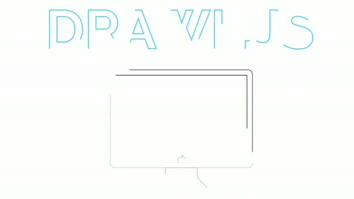

## Drawl.js (Draw & Fill Your SVG Paths)
####JavaScript based CSS Animated Effect



### [LIVE DEMO](http://b-v.co/drawl/)

## Dependencies

None - Drawl is pure JavaScript. (No Jquery, no Raphael, & no Modernizr)

## Basic Usage

#### HTML 

A. Add an inline SVG to your page, and define the styles (fill, stroke, stroke-width, ect):

```xml
<svg xmlns="http://www.w3.org/2000/svg" id="svg" class="drawl" viewBox="0 0 960 480" preserveAspectRatio="xMinYMin meet">
    <path fill="..." stroke="..." stroke-width="..."/> 
    <path fill="..." stroke="..." stroke-width="..."/>
    <path fill="..." stroke="..." stroke-width="..."/>
    <path fill="..." stroke="..." stroke-width="..."/>
</svg>
```

Additional Info:

* To achieve the "draw" effect, SVG must have a `stroke`.
* To achieve the fade-in fill effect, SVG must have a `fill`.
* All shapes in the SVG must be defined as `path` for Drawl to work
* In order to determine which SVGs will be targeted, SVG tags must have the class "drawl" (or you can change this to something else - see further below.)

#### Javascript

```
<script>
new Drawl(); //everything default
</script>
```

Creating the new instance automatically performs the animation.

#### Options
Default settings for Drawl:
```
<script>
    new Drawl({
                drawlClass: "drawl", //animated element html class
                replayClass: null, // animation relay html cass (must be defined in order for the replay function to work)
                initialDelay: 0 // delay animation, time in milliseconds (1000ms = 1s)
    });
</script>
```

Sample of configured settings that you might use:

```
<script>
    new Drawl({
                drawlClass: "drawl", //animated element html class
                replayClass: 'drawl-again', // you'll be able to click on any element with this class to reanimate
                initialDelay: 1000 // animation will be delayed by 1000ms (1 second)
    });
</script>
```

## Replay the animation

Assigning the `replay` function is simple. Just define the `replayClass` in your `new Drawl` instance.

Lets say you want your `replayClass` to be `'drawl-again'`.

Here's an example of that action:

```xml
<button class="drawl-again">animate again</button>
<script>
       new Drawl({
            replayClass : "drawl-again",
        });
</script>
```

Want the SVG itself to replay when you click it?

Easy! Since your animated SVG already has `class='drawl`, you can just define the `replayClass` as `drawl`:

```
<svg xmlns="http://www.w3.org/2000/svg" id="svg" class="drawl" viewBox="0 0 960 480" preserveAspectRatio="xMinYMin meet">
  <path fill="..." stroke="..." stroke-width="..."/>
</svg>
<script>
       new Drawl({
            replayClass : "drawl",
        });
</script>
```

## Browser Support

This plugin will only work in browsers that support both SVGs and SVG effects for HTML:

Right now this plug will not work with Internet Explorer since it has horrible support for SVG effects. Drawl SVGs in IE will just show up completely filled in with no magic.

1. [SVGs](http://caniuse.com/#feat=svg) - IE**, FF 31+, Chrome 31+, Safari 7+, iOS Safari 7.1+, and Android Browser 4.4+
2. [SVG Effects for HTML ](http://caniuse.com/#feat=svg-html) - IE**, FF 31+, Chrome 31+, iOS Safari 7.1+, and Android Browser 4.4+

**Planning on adding support to IE soon.

In order for the plugin to work properly, please convert all shapes to paths.

## Background Info
So how is all this achieved? SVG comes with a range of attributes and elements for us to leverage and manipulate. Of key importance will be the following:

In order for the plugin to work properly, please convert all shapes to paths.

* `fill` and `fill-opacity` - defines the fill colour of an SVG element, and that fill colour's opacity
* `stroke` and `stroke-opacity` - defines the stroke colour of an SVG element, and that stroke colour's opacity
* `stroke-dashoffset` - defines the distance into the dash pattern to start the dash
* `stroke-dasharray` - controls the pattern of dashes and gaps used to stroke paths

You can read more about each of these properties on the [MDN attribute reference](https://developer.mozilla.org/en-US/docs/Web/SVG/Attribute).

### Resetting & Drawing The Stroke

Resetting and drawing the stroke is achieved by a very well documented technique which you can read about [here](http://jakearchibald.com/2013/animated-line-drawing-svg/). 

In a nutshell, it works like this:

1. Calculate the length of an SVG path.
2. Reset all transitions on the path to none.
3. This might seem like the confusing one, but give it a little thought and it will become clear. Set the `stroke-dasharray` to [length, length], and the `stroke-dashoffset` to [length], ultimately making the dash as long as the stroke itself, and offsetting it to the length of the stroke making it initially invisible. This is the technique mentioned in the link above.
4. Add a transition to the `stroke-dashoffset` property.
5. Set the `stroke-dashoffset` to 0, ultimately "drawing" the stroke.

This is all done via JavaScript, so all calculations and transitions are done dynamically, making it easy.

### Fade Out The Stroke, Fade In The Fill

This function leverages on transition event listeners, and listens for the ending of the stroke transition. Transition end events require prefixing due to different browser engines, and I'm using Modernizr to do take care of it in my function. You can read more about that in [this post](http://callmenick.com/2014/10/19/cross-browser-transition-animation-events-modernizr/). Once the stroke has finished drawing itself, the following happens:

1. Reset the transitions on the path to `none` again.
2. Set the transitions on the `fill-opacity` and `stroke-opacity` properties.
3. Change `fill-opacity` to 1.
4. Change `stroke-opacity` to 0.
## About

Initiated by [Nick Salloum](http://callmenick.com) (Draw-Fill-SVG); Development (Drawl.js) by [Brennan Vargas](http://twitter.com/brennanv); huge thanks go to him for getting this started.

## License

Licensed under the MIT license - http://www.opensource.org/licenses/mit-license.php

Free for personal and commercial use.